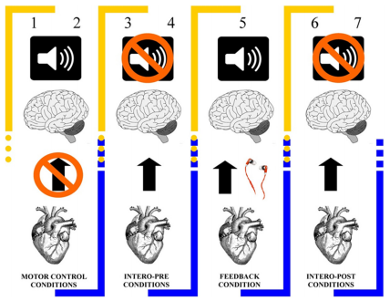

# Heartbeat Detection (HBD) Task

Welcome to the Heartbeat Detection (HBD) Task folder! This repository contains resources and instructions for conducting the Heartbeat Detection Task, a classic interoceptive task used in research and clinical settings.

## Overview

The Heartbeat Detection (HBD) Task is a fundamental task in interoception research. It assesses an individual's ability to perceive and accurately detect their own heartbeat without external aids. This task is widely used to investigate interoceptive awareness and sensitivity.

## Task Description

In this version of the Heartbeat Detection (HBD) Task, participants are instructed to sit quietly and focus their attention inward, specifically on the sensations of their heartbeat. They are asked to detect each heartbeat they perceive during a predefined time interval, without using any external methods (e.g., taking their pulse). Participants will indicate their heartbeat detections by pressing a keyboard button.

## Usage

Feel free to use the materials provided in this repository to conduct the Heartbeat Detection (HBD) Task in your research or clinical practice. The task instructions, stimuli, and data collection procedures are available for customization and adaptation to your specific needs.

## Materials

- **Task Instructions**: You will either have to follow your own heartbeat without external queues, or a recorded heartbeat. You will also answer a likert scale evaluating interoceptive accuracy and awareness.
- **Stimulus Presentation**: You will require psychtoolbox to be added to your matlab path in order to run this task.
- **Data Collection Forms**: A "log".mat structure will be created with various indexes including RT, ACC, timestamps, EEG events, etc. The structure will be named after the subject code.

## Example Image

## Citation

If you use the Heartbeat Detection (HBD) Task in your work, please cite the following paper:

- Salamone, P. C., Sedeño, L., Legaz, A., Bekinschtein, T., Martorell, M., Adolfi, F., ... & Ibáñez, A. (2020). Dynamic neurocognitive changes in interoception after heart transplant. Brain communications, 2(2), fcaa095.

## License

This repository is licensed under the MIT License. See the https://opensource.org/license/mit/ (LICENSE) file for details.

## Contact
